<div align="center">

# MedXpert — Symptom-to-Medicine Chat Assistant with SQL Search, GPT-4 Summaries and Medicine Manuals

**MedXpert is a Streamlit chat assistant for medicine information. It takes a symptom that a user types through these steps to a maximum of three top-rated medicines, each with a patient-level summary and a ratings chart:**

`classify the message` → `rewrite the symptom as a keyword` → `generate SQL` → `query PostgreSQL` → `summarize each medicine` → `plot the ratings`.


**[Summary](#1-summary)** ·
**[Workflow](#4-the-end-to-end-workflow)** ·
**[SQL agent](#7-the-sql-agent-and-the-medicines-table)** ·
**[Run it](#14-how-to-run-medxpert)** ·
**[Known problems](#17-known-problems)** ·
**[Glossary](#19-glossary)**

</div>

> [!NOTE]
> This README uses ASD-STE100 Simplified Technical English. The writing rules and the project
> vocabulary are in [`docs/ste-style-guide.md`](docs/ste-style-guide.md). Each term in the
> [Glossary](#19-glossary) has only one meaning.

> [!CAUTION]
> Do not use MedXpert to select, take or dose a medicine. It is a student research prototype, and a language model writes its text.
> The text can be wrong, and the app shows no medical disclaimer. The user manual page writes a manual from fixed sample data, not from the medicine that you type.
> A doctor or a pharmacist must review every decision about a medicine.

---

MedXpert is a medical chatbot that two students built for a university project in 2025.
A user types a symptom or a general message. A GPT-4 classifier selects the route for the message.
For a symptom, GPT-4 writes a PostgreSQL query, the app reads a maximum of three medicines from a medicines table, and GPT-4 writes a patient-level summary of each medicine.
A second page writes a medicine user manual in the language that the user types.
Separate scripts load DailyMed drug labels and their images into a Qdrant vector database, and two small Streamlit apps search that vector data.

This README is the **one location that explains all of MedXpert**. It gives these topics:

- the general design
- each component and its procedure, step by step
- the datasets
- the status of each feature that the earlier README claimed
- the data map
- the runbook
- the validation results and the known problems

| If you are… | Read |
|---|---|
| A manager or reviewer | [1](#1-summary), [3](#3-design-rules), [4](#4-the-end-to-end-workflow), [12](#12-feature-status), [16](#16-validation-results), [18](#18-key-points) |
| A developer who joins the project | All sections, in sequence. Keep [14](#14-how-to-run-medxpert) and [17](#17-known-problems) open while you work |
| An operator who runs MedXpert | [14](#14-how-to-run-medxpert), then the section for the app or script that you use |

---

## Table of contents

1. 🧭 [Summary](#1-summary)
2. 🏗️ [How MedXpert is built](#2-how-medxpert-is-built)
   - 2.1 [Components](#21-components)
   - 2.2 [System context](#22-system-context)
   - 2.3 [Repository layout](#23-repository-layout)
3. 🛡️ [Design rules](#3-design-rules)
4. 🔄 [The end-to-end workflow](#4-the-end-to-end-workflow)
   - 4.1 [Full flow](#41-full-flow)
   - 4.2 [The life cycle of one symptom query](#42-the-life-cycle-of-one-symptom-query)
   - 4.3 [Who does which step](#43-who-does-which-step)
5. 💬 [The chat app](#5-the-chat-app)
6. 🧠 [The LLM agent](#6-the-llm-agent)
7. 🗄️ [The SQL agent and the medicines table](#7-the-sql-agent-and-the-medicines-table)
8. 📘 [The user manual generator](#8-the-user-manual-generator)
9. 🔎 [The vector search tools](#9-the-vector-search-tools)
10. 🧾 [The DailyMed ingestion and OCR](#10-the-dailymed-ingestion-and-ocr)
11. 📚 [The datasets](#11-the-datasets)
12. 📋 [Feature status](#12-feature-status)
13. 🗂️ [Data and file map](#13-data-and-file-map)
14. ▶️ [How to run MedXpert](#14-how-to-run-medxpert)
    - 14.1 [Prerequisites](#141-prerequisites) · 14.2 [Installation](#142-installation) · 14.3 [Run MedXpert](#143-run-medxpert) · 14.4 [Environment variables](#144-environment-variables)
15. 🧩 [How to extend MedXpert](#15-how-to-extend-medxpert)
16. ✅ [Validation results](#16-validation-results)
17. ⚠️ [Known problems](#17-known-problems)
18. 📌 [Key points](#18-key-points)
19. 📖 [Glossary](#19-glossary)
20. 📄 [License](#20-license)

---

## 1. Summary

**The problem.** Many patients cannot find a clear medicine suggestion for a symptom that they describe in their own words.
Medicine data uses clinical words, and most sources give no regional language. These questions are difficult:

- How do you change an informal symptom, such as "burning chest", into a term that a database can search?
- How do you get structured medicine facts, not invented facts, for that term?
- How do you explain the facts of a medicine in words that a patient understands?
- How do you give the same information in the language of the patient?

MedXpert answers the first three questions in its chat app and the fourth question in its user manual page.

| Item | Value |
|---|---|
| Input | A chat message (symptom or general message), or a medicine name and a language |
| Output | A maximum of 3 medicines, each with an image and a GPT-4 summary, a ratings bar chart, the generated SQL, or a downloadable `.txt` manual |
| Routes | **2**: `general_chat` and `symptom_query`, selected by a GPT-4 classifier |
| Agent modules | **2**: `agents/llm_agent.py` (5 functions) and `agents/sql_agent.py` (1 function) |
| GPT functions | **7**: 6 use `gpt-4`, 1 (`chat_with_user`, not called) uses `gpt-3.5-turbo` |
| Structured store | PostgreSQL table `medicines_table` (9 columns). The connection module is not in the repository |
| Vector store | Qdrant collection `medxpert_medicines` (384 dimensions, cosine) and a ChromaDB collection `drug_images` |
| Embedding model | `all-MiniLM-L6-v2` from Sentence Transformers |
| Data sources | DailyMed SPL monthly archives and the Kaggle "11,000+ Medicine Details" dataset |
| Front-end | Streamlit 1.33 |
| Tests | **0**. The repository has no tests and no CI |
| Authors | Krishna Annavaram and Vighnasree Vara |

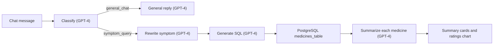

The repository has three parts:

| Part | Files | Status |
|---|---|---|
| Chat app | `app.py`, `agents/`, `pages/1_User_Manual.py`, `modules/` | Main app. Needs the `database/db_connection.py` module, which is not committed |
| Vector search | `build_qdrant.py`, `qdrant_search_app.py`, `vector_test.py`, `chroma_test_app.py` | Separate test tools. Not connected to the chat app |
| Label ingestion | `dailymed_ingest_qdrant.py`, `ocr_to_fields.py` | Batch scripts for DailyMed archives. The data is not committed |

---

## 2. How MedXpert is built

### 2.1 Components

| Component | File | Purpose |
|---|---|---|
| Chat app | `app.py` | Streamlit app with three sidebar pages: Home (chat), User Manual (help text) and About MedXpert |
| LLM agent | `agents/llm_agent.py` | Classify a message, write a general reply, rewrite a symptom, summarize medicines |
| SQL agent | `agents/sql_agent.py` | Ask GPT-4 for one PostgreSQL query on `medicines_table` |
| Database connection | `database/db_connection.py` | `run_sql_query(sql)` returns the columns and the rows. **Not committed** (git ignores `database/`) |
| User manual page | `pages/1_User_Manual.py` | Streamlit page: medicine name and language in, manual text out, download button |
| User manual generator | `modules/user_manual_generator.py` | GPT-4 prompt that writes an 8-part manual in a given language |
| Qdrant sample loader | `build_qdrant.py` | Make the collection `medxpert_medicines` and add 3 sample medicines |
| Qdrant search app | `qdrant_search_app.py` | Streamlit app: top 3 semantic matches for a keyword |
| Qdrant test script | `vector_test.py` | Print the top 3 matches for a fixed query |
| ChromaDB search app | `chroma_test_app.py` | Streamlit app: top 3 matches in the ChromaDB collection `drug_images` |
| DailyMed ingestion | `dailymed_ingest_qdrant.py` | Read SPL ZIP archives, read the label images with OCR, write text records, add vectors to Qdrant |
| OCR test script | `ocr_to_fields.py` | Read the first image of one SPL ZIP file with Tesseract and print the clean text |
| Presentation | `MedXpert.pptx` | 17-slide project deck: problem, literature, design, datasets, results, references |

The component map shows which file calls which file. An arrow points from the caller to the file or store that it uses. The three parts share no code.

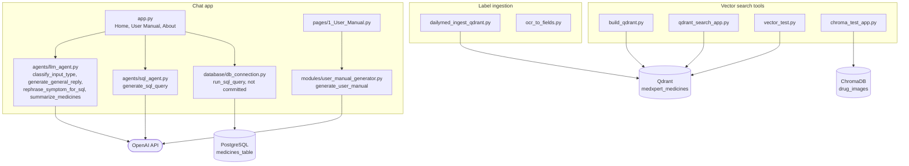

### 2.2 System context

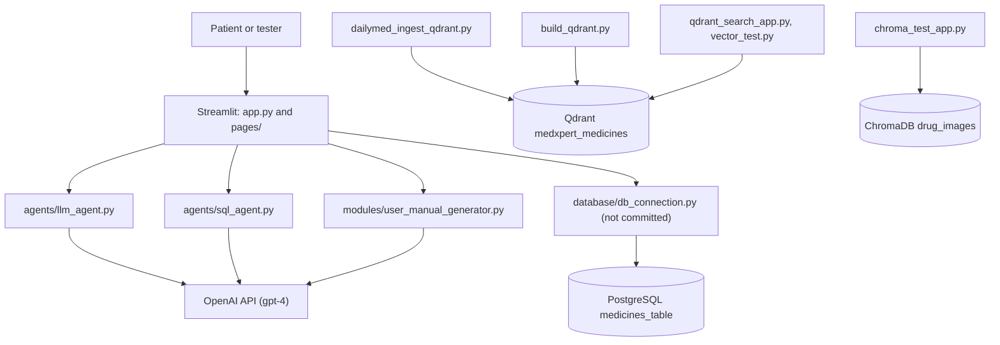

The chat app does not read Qdrant or ChromaDB. The vector tools are separate programs.

### 2.3 Repository layout

```
medxpert/
├── app.py                        # main Streamlit chat app (Home, User Manual, About)
├── agents/
│   ├── __init__.py               # empty
│   ├── llm_agent.py              # classify, reply, rewrite, summarize (OpenAI v1 client)
│   └── sql_agent.py              # text-to-SQL prompt (OpenAI v1 client)
├── modules/
│   └── user_manual_generator.py  # multilingual manual prompt (OpenAI 0.28 API)
├── pages/
│   └── 1_User_Manual.py          # Streamlit page: manual generator
├── build_qdrant.py               # make the Qdrant collection, add 3 samples
├── dailymed_ingest_qdrant.py     # DailyMed SPL ZIP files to text records and Qdrant
├── ocr_to_fields.py              # OCR test on one SPL ZIP file
├── qdrant_search_app.py          # Streamlit semantic search over Qdrant
├── vector_test.py                # command-line Qdrant search
├── chroma_test_app.py            # Streamlit semantic search over ChromaDB
├── MedXpert.pptx                 # project presentation
├── requirements.txt              # 16 pinned packages
├── docs/ste-style-guide.md       # writing rules and project vocabulary
├── LICENSE                       # MIT
└── database/                     # git ignores it: db_connection.py and the table data
```

---

## 3. Design rules

These rules come from the code. They describe how MedXpert works now.

### 3.1 A classifier selects the route
Each chat message goes to `classify_input_type` first. GPT-4 at temperature 0 returns `general_chat` or `symptom_query`. Any other answer gives a "please rephrase" message.

### 3.2 Medicine facts come from the table
The chat app does not ask GPT-4 to name medicines. GPT-4 writes the SQL, and the medicine names, compositions, uses and side effects come from the rows of `medicines_table`. GPT-4 then writes the explanation of those rows.

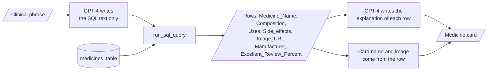

### 3.3 A symptom becomes a clinical keyword before the SQL step
`rephrase_symptom_for_sql` changes the words of the user into a short clinical phrase, for example "burning chest" to "acid reflux". The app shows this phrase as "Interpreted Symptom".

### 3.4 The SQL search is narrow and sorted by rating
The SQL prompt tells GPT-4 to search `Uses`, `Medicine_Name` and `Composition` with `ILIKE`, to sort by `Excellent_Review_Percent` in descending sequence, and to return a maximum of 3 rows.

### 3.5 The user can see the generated SQL
The app shows each generated query in the expander "Click to view SQL Agent Generated Query". A reviewer can compare the query with the result.

### 3.6 One embedding model for all vector data
All vector scripts use `all-MiniLM-L6-v2` (384 dimensions) for both the stored text and the query. The Qdrant collection uses cosine distance.

### 3.7 Credentials stay out of the code
The OpenAI key comes from `OPENAI_API_KEY` in a local `.env` file. Git ignores `.env`, `*.env` and the `database/` folder. No committed file holds a key or a password.

---

## 4. The end-to-end workflow

### 4.1 Full flow

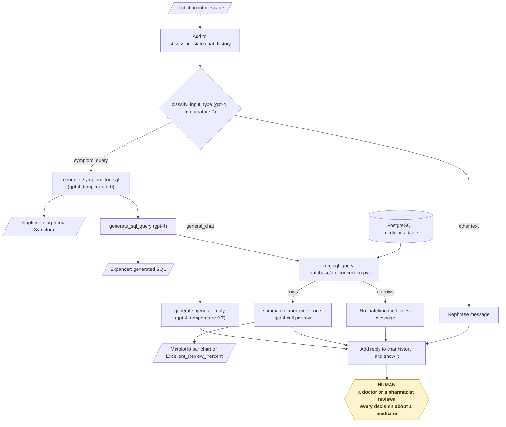

### 4.2 The life cycle of one symptom query

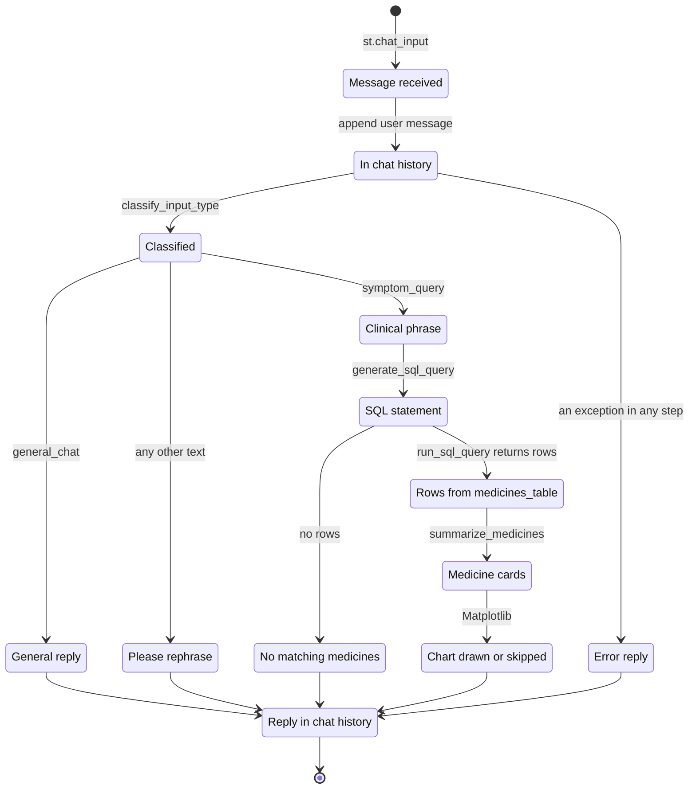

1. The user types a message, for example "What to take for sore throat?".
2. The app adds the message to the chat history in the Streamlit session.
3. `classify_input_type` returns `symptom_query`.
4. `rephrase_symptom_for_sql` returns a clinical phrase. The app shows it as a caption.
5. `generate_sql_query` returns one raw SQL statement. The app shows it in an expander.
6. `run_sql_query` runs the statement and returns the column names and the rows.
7. `summarize_medicines` sends one GPT-4 prompt for each row and builds one HTML card for each medicine.
8. If the rows have `Medicine_Name` and `Excellent_Review_Percent`, the app draws a bar chart.
9. The app adds the reply to the chat history and shows it.

A symptom query makes a maximum of 6 GPT-4 calls: classify, rewrite, SQL, and one summary for each of 3 rows.
If a step raises an exception, the reply is `⚠️ Error: <message>`.

### 4.3 Who does which step

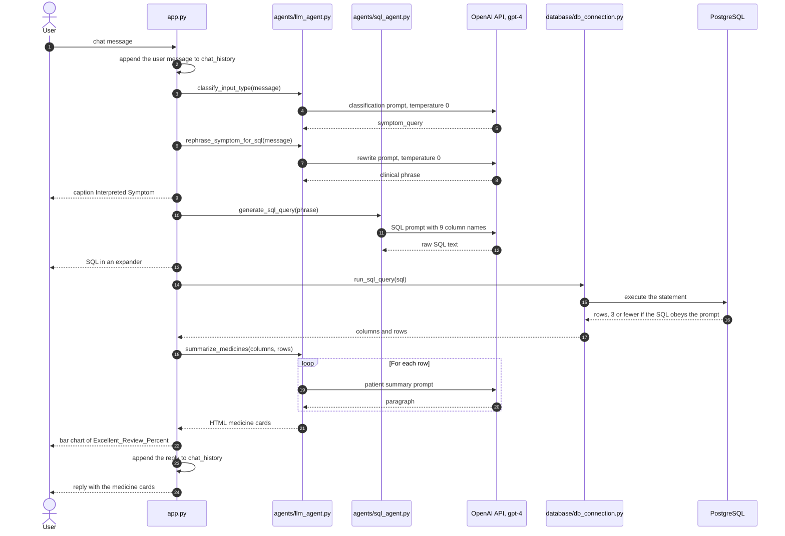

---

## 5. The chat app

**Purpose.** Give one chat window for symptoms and general messages, and two information pages.

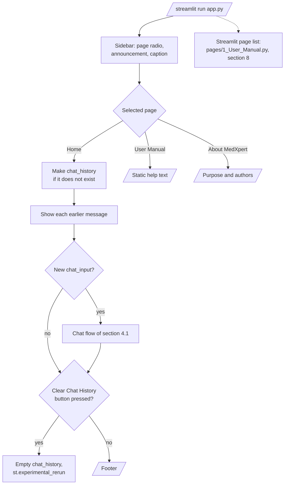

| Sidebar page | Contents |
|---|---|
| Home | Chat history, chat input, interpreted symptom, SQL expander, medicine cards, ratings chart, "Clear Chat History" button |
| User Manual | Static help text: what to type, what the app shows |
| About MedXpert | Purpose of the app and the names of the authors |

Streamlit also shows `pages/1_User_Manual.py` in its page list, because the file is in the `pages/` folder. That page is the [user manual generator](#8-the-user-manual-generator). It is different from the static "User Manual" sidebar page.

**Rules**

- The chat history is in `st.session_state.chat_history`. It is lost when the browser session ends.
- The app adds the user message before the GPT calls and the reply after them, also when an error occurs.
- "Clear Chat History" empties the history and calls `st.experimental_rerun()`.
- The sidebar shows the announcement "MedXpert Phase 1 Completed! Coming Soon: Audio Input/Output + Multilingual Support!".
- The chart is a Matplotlib bar chart, 12 × 6 inches, title "Medicine vs Excellent Review %". If the chart fails, the app shows "Visualization skipped" and continues.

---

## 6. The LLM agent

**Purpose.** Hold the GPT prompts for the chat app. File: `agents/llm_agent.py`. The module uses the OpenAI v1 client (`from openai import OpenAI`).

The diagram shows `summarize_medicines`, the function with the most steps.

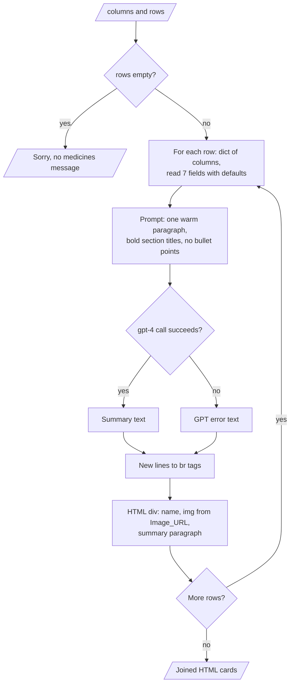

| Function | Model | Temperature | Input | Output |
|---|---|---|---|---|
| `classify_input_type` | `gpt-4` | 0 | Message | `general_chat` or `symptom_query` (lower case) |
| `generate_general_reply` | `gpt-4` | 0.7 | Message | A warm reply of 1 to 2 lines as "MedXpert" |
| `rephrase_symptom_for_sql` | `gpt-4` | 0 | Message | A short clinical keyword phrase |
| `summarize_medicines` | `gpt-4` | default | Columns and rows | HTML cards, one for each medicine |
| `chat_with_user` | `gpt-3.5-turbo` | default | Message | A reply. **No code calls this function** |

**Procedure of `summarize_medicines`**

1. If there are no rows, return "Sorry, I couldn't find any medicines matching your symptoms."
2. For each row, read `Medicine_Name`, `Image_URL`, `Composition`, `Uses`, `Side_effects`, `Manufacturer` and `Excellent_Review_Percent`.
3. Send a prompt with these values. The prompt asks for one warm paragraph to a patient, with bold section titles and no bullet points.
4. If the call fails, use `⚠️ GPT error: <message>` as the text.
5. Change each new line to `<br>` and put the name, the image and the text in one HTML `<div>`.
6. Join the cards and return them.

The rewrite prompt gives four examples: "ear pain" to "ear infection", "burning chest" to "acid reflux", "itchy skin" to "allergic reaction", and "feeling sick" to "nausea".

---

## 7. The SQL agent and the medicines table

**Purpose.** Change a clinical phrase into one PostgreSQL query. File: `agents/sql_agent.py`.

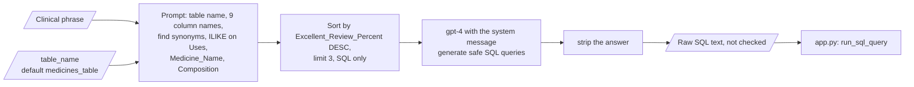

| Input | Output |
|---|---|
| The clinical phrase and the table name (default `medicines_table`) | One raw SQL statement as text |

**Procedure**

1. Give GPT-4 the table name and the 9 column names (case-sensitive).
2. Tell GPT-4 to find synonyms and related medical terms for the phrase.
3. Tell GPT-4 to search `"Uses"`, `"Medicine_Name"` or `"Composition"` with `ILIKE` for those terms.
4. Tell GPT-4 to sort by `"Excellent_Review_Percent"` `DESC` and to limit the result to 3 rows.
5. Tell GPT-4 to return only the SQL, with no Markdown fence and no comment.
6. Return the text of the answer without other changes.

**The columns of `medicines_table`**

| Column | Meaning |
|---|---|
| `Medicine_Name` | Name of the medicine |
| `Composition` | Active ingredients and strength |
| `Uses` | Conditions that the medicine treats |
| `Side_effects` | Known side effects |
| `Image_URL` | URL of a product image |
| `Manufacturer` | Company that makes the medicine |
| `Excellent_Review_Percent` | Percentage of excellent user reviews |
| `Average_Review_Percent` | Percentage of average user reviews |
| `Poor_Review_Percent` | Percentage of poor user reviews |

These columns match the Kaggle "11,000+ Medicine Details" dataset. The repository has no script that loads this dataset into PostgreSQL.

The diagram gives the columns that the SQL prompt names. The repository has no schema file, so the diagram shows each column type as `unknown`.

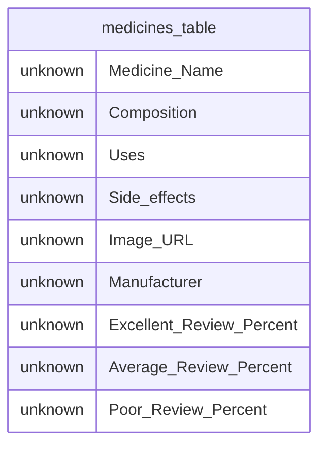

**Rules**

- The app runs the generated SQL directly. No code checks that the statement is a `SELECT`. Use a read-only database role.
- The column names are case-sensitive, so the SQL must put them in double quotes.

---

## 8. The user manual generator

**Purpose.** Write a patient-level medicine manual in the language that the user types.

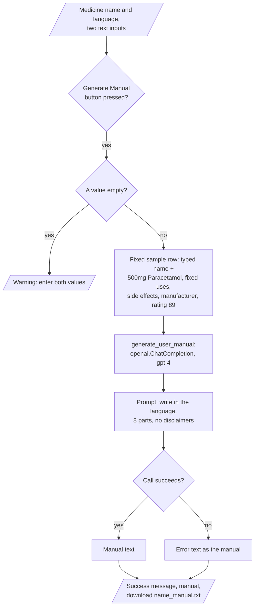

| Input | Output |
|---|---|
| A medicine name and a language name (free text, for example English, Hindi, Telugu or Spanish) | Manual text on the page and a download file `<medicine name>_manual.txt` |

**Procedure**

1. The page `pages/1_User_Manual.py` asks for the medicine name and the language.
2. If one value is empty, the page shows a warning.
3. The page makes a fixed sample row. Only the name comes from the user. The other values are fixed: `500mg Paracetamol`, "Fever, body pain, and inflammation", "Nausea, dizziness, allergic reactions", `Generic Pharma Ltd.` and rating `89`.
4. `generate_user_manual` sends the row and the language to `gpt-4`.
5. The prompt asks for paragraphs in 8 parts: Introduction, Dosage Instructions, How and When to Take, Where to Store, Side Effects, Precautions, Manufacturer Information and Emergency Advice.
6. The prompt tells GPT-4 not to add disclaimers.
7. The page shows the manual and a download button.

**Rules**

- The language support comes only from GPT-4. The code has no translation model.
- Because of step 3, every manual describes paracetamol data with the typed name. The page does not read the database.
- `modules/user_manual_generator.py` uses the old `openai.ChatCompletion.create` API (`openai` 0.28). The chat agents use the v1 client. See [Known problems](#17-known-problems).

---

## 9. The vector search tools

**Purpose.** Test semantic search over medicine text. These tools are not connected to the chat app.

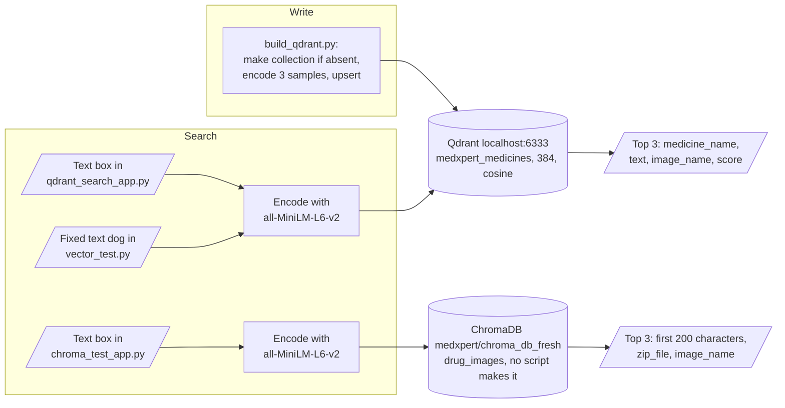

| Tool | Store | Collection | Query | Result |
|---|---|---|---|---|
| `build_qdrant.py` | Qdrant `localhost:6333` | `medxpert_medicines` | — | Makes the collection (384, cosine) if it does not exist, adds 3 samples: Paracetamol, Ibuprofen, Amoxicillin |
| `qdrant_search_app.py` | Qdrant `localhost:6333` | `medxpert_medicines` | Text box | Top 3: `medicine_name`, `text`, `image_name` |
| `vector_test.py` | Qdrant `localhost:6333` | `medxpert_medicines` | Fixed text `"dog"` | Prints the top 3 payloads and scores |
| `chroma_test_app.py` | ChromaDB folder `medxpert/chroma_db_fresh` | `drug_images` | Text box | Top 3: first 200 characters of the text, `zip_file`, `image_name` |

**Procedure of a search**

1. Encode the query with `all-MiniLM-L6-v2`.
2. Send the vector to the store and ask for 3 results with their payload.
3. Show each result. If there is no result, show a warning.

**Rules**

- `build_qdrant.py` and `dailymed_ingest_qdrant.py` write to the same collection. The sample points have a `text` field. The DailyMed points do not have it, so `qdrant_search_app.py` shows an empty "Info" for them.
- No script in the repository makes the ChromaDB collection `drug_images`.

---

## 10. The DailyMed ingestion and OCR

**Purpose.** Change DailyMed SPL ZIP archives into text records and Qdrant points.

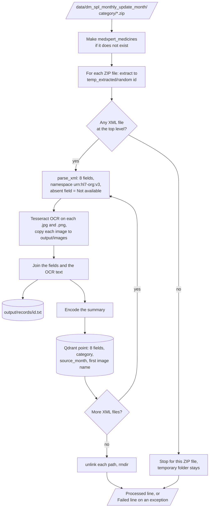

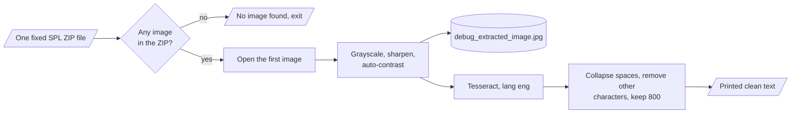

| Input | Output |
|---|---|
| `data/dm_spl_monthly_update_<month>/<category>/*.zip` | `output/records/<id>.txt`, `output/images/<month>/<category>/<image>`, one Qdrant point for each XML file |

**Procedure of `dailymed_ingest_qdrant.py`**

1. Make the Qdrant collection `medxpert_medicines` if it does not exist.
2. For each month folder and each category folder, open each ZIP file.
3. Extract the ZIP file into `temp_extracted/<random id>/`.
4. For each XML file, read 8 fields: `title`, `activeIngredient`, `indicationsAndUsage`, `dosageAndAdministration`, `storageAndHandling`, `adverseReactions`, `manufacturer` and `useInSpecificPopulations`. The namespace is `urn:hl7-org:v3`. An absent field becomes "Not available".
5. Read each `.jpg` and `.png` image with Tesseract OCR and copy the image to `output/images/`.
6. Join the fields and the OCR text into one summary. Write it to `output/records/<id>.txt`.
7. Encode the summary and add one point. The payload has the 8 fields, `category`, `source_month` and the first image name.
8. Delete the temporary folder. Print one line for each ZIP file. If the ZIP file has no XML file at the top level, the script stops for that file before this step, and the temporary folder stays.

**Procedure of `ocr_to_fields.py`**

1. Open one fixed ZIP file: `data/dm_spl_monthly_update_mar2025/otc/20250302_1d4fcb76-22d1-7292-e063-6394a90af920.zip`.
2. Read the first image. Change it to grayscale, sharpen it and apply auto-contrast.
3. Save the image as `debug_extracted_image.jpg` for a visual check.
4. Run Tesseract with `lang="eng"`.
5. Remove extra spaces and characters outside `A-Za-z0-9.,:;()%-`. Keep the first 800 characters and print them.

**Rules**

- The Tesseract path is fixed to `C:\Program Files\Tesseract-OCR\tesseract.exe` in `dailymed_ingest_qdrant.py`.
- The SPL format keeps most label sections in `<section>` elements with LOINC codes. The tag names of step 4 were not checked against real SPL files, so many fields can be "Not available".
- `ocr_to_fields.py` prints text only. It does not map the text to fields.

---

## 11. The datasets

The data is not in the repository. Git ignores `data/`, `output/`, `*.csv`, `*.json` and the images.

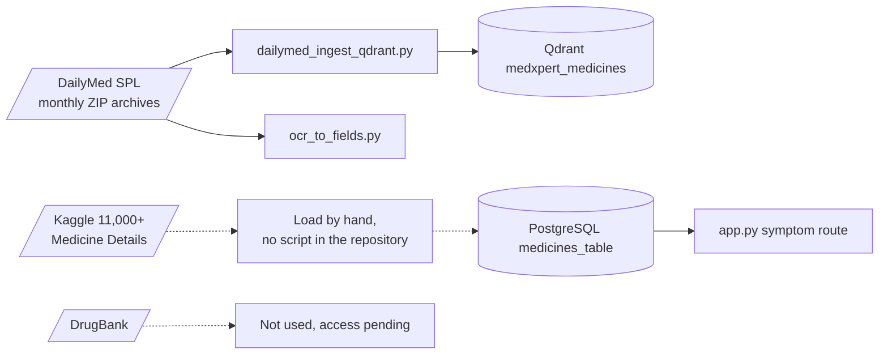

| Dataset | Source | Use in the code | Facts from `MedXpert.pptx` |
|---|---|---|---|
| DailyMed SPL monthly archives | [DailyMed](https://dailymed.nlm.nih.gov/dailymed/), [HealthData.gov](https://healthdata.gov/dataset/DailyMed/j3hv-i8vg) | `dailymed_ingest_qdrant.py`, `ocr_to_fields.py` | August 2024 to February 2025, 49,316 labels, about 13.13 GB of ZIP files with XML and label images |
| 11,000+ Medicine Details | [Kaggle](https://www.kaggle.com/datasets/singhnavjot2062001/11000-medicine-details) | The columns of `medicines_table` | More than 11,000 rows: name, composition, uses, side effects, manufacturer, image URL, review percentages |
| DrugBank | [go.drugbank.com](https://go.drugbank.com) | Not used | Access was requested as a fallback source. It was pending |

**Monthly SPL archive sizes (from the deck)**

| Month | Labels | File size |
|---|---|---|
| Aug 2024 | 4,887 | 1.67 GB |
| Sep 2024 | 4,493 | 1.39 GB |
| Oct 2024 | 9,801 | 256.25 MB |
| Nov 2024 | 8,038 | 2.67 GB |
| Dec 2024 | 10,396 | 3.58 GB |
| Jan 2025 | 7,670 | 2.58 GB |
| Feb 2025 | 4,031 | 1.56 GB |
| **Total** | **49,316** | **about 13.13 GB** |

The earlier README also named "custom labeled translations (MarianMT and post-processing)". The repository has no such data and no MarianMT code.

---

## 12. Feature status

The earlier README and the deck describe more features than the code has. This table gives the status of each claim.

| Claim | Status in the code |
|---|---|
| Input classification ("MCP", "Module Context Protocol" or "Model Context Protocol") | Built as the GPT-4 prompt `classify_input_type`. It is not the Model Context Protocol |
| SQL agent with GPT-4 | Built (`agents/sql_agent.py`) |
| LLM summarizer for patients | Built (`summarize_medicines`) |
| Rating chart | Built (Matplotlib in `app.py`) |
| Vector agent in the chat route ("RoutingAgent") | Not built. Vector search exists only in separate test apps |
| Rating-based query route | Not built. The classifier has two routes only |
| Multilingual manual | Built with a GPT-4 prompt. It uses fixed sample data (see [section 8](#8-the-user-manual-generator)) |
| MarianMT, "100+ languages" | Not in the code |
| OCR of prescriptions with Tesseract and NER | Not built. Tesseract reads DailyMed label images. There is no NER and no prescription upload |
| spaCy, TF-IDF | Not in the code |
| LangChain agents | `langchain` is in `requirements.txt`, but no file imports it |
| Docker, Azure, GCP App Engine, FastAPI, GitHub Actions, MLflow, Power BI | Not in the repository |
| HIPAA-safe deployment | Not in the repository |
| Audio input and output, multilingual chat | Planned. The sidebar announces them as "Coming Soon" |

---

## 13. Data and file map

| Path | Committed? | Contents |
|---|---|---|
| `.env` | No (git ignores it) | `OPENAI_API_KEY` |
| `database/db_connection.py` | No (git ignores `database/`) | `run_sql_query(sql)`. Required by `app.py` |
| `data/dm_spl_monthly_update_*/<category>/*.zip` | No (git ignores it) | DailyMed SPL archives |
| `temp_extracted/` | No (git ignores it) | Temporary ZIP contents. Deleted after each ZIP file that has an XML file |
| `output/records/*.txt` | No (git ignores it) | One text record for each SPL XML file |
| `output/images/<month>/<category>/` | No (git ignores it) | Copies of the label images |
| `qdrant_data/` | No (git ignores it) | Local Qdrant storage |
| `medxpert/chroma_db_fresh/` | No (git ignores `chroma_db_fresh/`) | ChromaDB storage of `chroma_test_app.py` |
| `debug_extracted_image.jpg` | No (git ignores `*.jpg`) | Image from `ocr_to_fields.py` |
| `<medicine name>_manual.txt` | Downloaded by the user | Manual text from the manual page |
| `MedXpert.pptx` | Yes | Project presentation |
| `medenv/` | No (git ignores it) | Local virtual environment |

---

## 14. How to run MedXpert

### 14.1 Prerequisites

| Need | For |
|---|---|
| Python 3 (the repository does not state a version. The pinned packages support 3.9 to 3.12) | All parts |
| An OpenAI API key with access to `gpt-4` | Chat app and manual page |
| A PostgreSQL database with `medicines_table` and your own `database/db_connection.py` | Chat app (symptom route) |
| A Qdrant server on `localhost:6333`, for example the `qdrant/qdrant` Docker image | `build_qdrant.py`, `qdrant_search_app.py`, `vector_test.py`, `dailymed_ingest_qdrant.py` |
| Tesseract OCR | `dailymed_ingest_qdrant.py`, `ocr_to_fields.py` |
| `matplotlib`, `qdrant-client`, `pytesseract`, `Pillow` | Imported by the code but not in `requirements.txt` |

### 14.2 Installation

```bash
git clone https://github.com/KrishnaAnnavaram/medxpert.git
cd medxpert
python -m venv medenv
. medenv/bin/activate                 # Windows: medenv\Scripts\activate
pip install -r requirements.txt
pip install matplotlib qdrant-client pytesseract Pillow
```

`requirements.txt` pins `openai==0.28.1`. The chat agents need the v1 client, and the manual generator needs 0.28. Select one:

```bash
pip install "openai>=1,<2"     # chat app works, manual page fails
pip install "openai==0.28.1"   # manual page works, chat app fails at import
```

Make a `.env` file in the repository root:

```
OPENAI_API_KEY=your_key_here
```

Write `database/db_connection.py` with a function `run_sql_query(sql)` that returns `(columns, rows)`. Then load the Kaggle table into PostgreSQL as `medicines_table` with the [9 columns](#7-the-sql-agent-and-the-medicines-table).

The diagram shows the setup steps in sequence and the result of each OpenAI version.

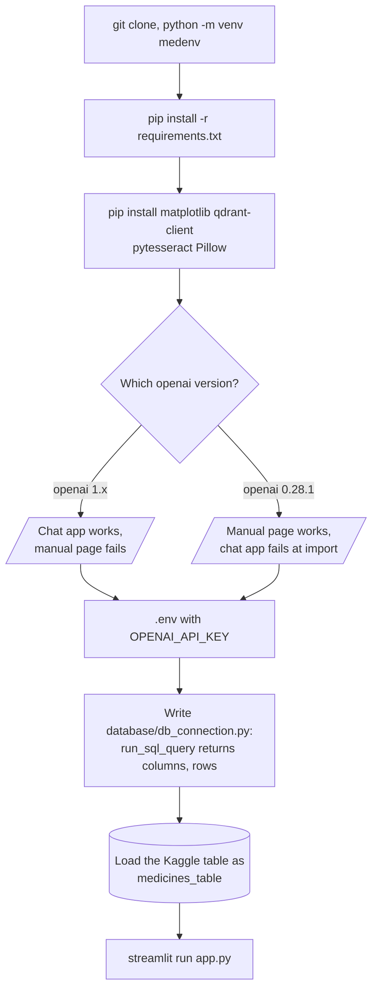

### 14.3 Run MedXpert

```bash
streamlit run app.py                   # chat app, with the manual page in the page list
python build_qdrant.py                 # make the Qdrant collection and add 3 samples
streamlit run qdrant_search_app.py     # semantic search over Qdrant
python vector_test.py                  # command-line Qdrant search (fixed query)
python dailymed_ingest_qdrant.py       # SPL ZIP files in data/ to records and Qdrant
python ocr_to_fields.py                # OCR test on one fixed SPL ZIP file
streamlit run chroma_test_app.py       # semantic search over ChromaDB (needs drug_images)
```

| Command | What it does |
|---|---|
| `streamlit run app.py` | Starts the chat app on the default Streamlit port 8501 |
| `python build_qdrant.py` | Makes `medxpert_medicines` and adds 3 sample points |
| `streamlit run qdrant_search_app.py` | Starts the Qdrant search app |
| `python vector_test.py` | Prints the top 3 Qdrant matches for `"dog"` |
| `python dailymed_ingest_qdrant.py` | Processes every SPL ZIP file in `data/` |
| `python ocr_to_fields.py` | Prints clean OCR text of one label image |
| `streamlit run chroma_test_app.py` | Starts the ChromaDB search app |

**Example messages for the chat app**

| Message | Route | Result |
|---|---|---|
| "Hello" or "Who are you?" | `general_chat` | A short reply as MedXpert |
| "What to take for sore throat?" | `symptom_query` | Interpreted symptom, SQL, up to 3 medicine cards, ratings chart |
| "fever", "cough" or "infection" | `symptom_query` | The same, for that symptom |

### 14.4 Environment variables

| Variable | Used by | Meaning |
|---|---|---|
| `OPENAI_API_KEY` | `agents/llm_agent.py`, `agents/sql_agent.py`, `modules/user_manual_generator.py` | OpenAI API key. Read from `.env` with `python-dotenv` |

The database settings are in `database/db_connection.py`, which is not committed. The Qdrant host and port (`localhost`, `6333`), the collection names and the Tesseract path are fixed in the code.

---

## 15. How to extend MedXpert

| You want to… | Do this | Code change? |
|---|---|---|
| Connect your own database | Write `database/db_connection.py` with a function `run_sql_query(sql)` that returns `(columns, rows)` | Small |
| Use a different table | Pass `table_name` to `generate_sql_query` and change the column list in the prompt | Small |
| Return more than 3 medicines | Change "Limit to 3 rows" in the SQL prompt | Small |
| Write a manual from real data | Read the row for the typed name from the database in `pages/1_User_Manual.py`, not the fixed sample row | Small |
| Add the vector search to the chat | Add a route in `app.py` that calls the Qdrant search of `qdrant_search_app.py` | Yes |
| Add a third route (for example rating questions) | Add the category to the `classify_input_type` prompt and a branch in `app.py` | Yes |
| Use another OpenAI model | Change the `model=` value in each function | Small |

Planned work, from the sidebar and the deck (not built): audio input and output, multilingual chat, disease prediction models and DrugBank as a fallback source.

---

## 16. Validation results

The repository has no tests and no numeric metrics. The only recorded check is qualitative, on slide 12 of `MedXpert.pptx`:

| Check | Result recorded in the deck |
|---|---|
| General messages such as "Hello" and "Who are you?" | Classified as general chat. The assistant replied politely and introduced itself as a medical assistant |
| Chat memory over many messages | The patient messages and the replies stayed in sequence. No message was lost |

Slides 13 and 14 show screenshots of symptom recommendations and of a generated manual. They give no numbers.

---

## 17. Known problems

Read these problems before you run or show MedXpert.

| # | Area | Problem | Impact and action |
|---|---|---|---|
| 1 | Absent module | `app.py` imports `database.db_connection`, but git ignores `database/` | `streamlit run app.py` fails on a clean clone. Write the module (see [14.2](#142-installation)) |
| 2 | OpenAI version | `requirements.txt` pins `openai==0.28.1`. The agents import `OpenAI`, which exists only in v1. The manual generator uses `openai.ChatCompletion`, which v1 removed | No single version runs both pages. Move the manual generator to the v1 client and update the pin |
| 3 | Requirements | `matplotlib`, `qdrant-client`, `pytesseract` and `Pillow` are absent. `langchain`, `tiktoken`, `googletrans`, `reportlab`, `requests`, `beautifulsoup4`, `lxml` and `html5lib` are listed but no committed file imports them | Install the absent packages by hand. Remove the unused packages |
| 4 | Medical safety | The manual page uses fixed paracetamol data for every medicine name, and its prompt forbids disclaimers. The chat app shows no disclaimer | A user can get wrong medicine instructions. Read real data, add a disclaimer, and do not show the app to patients |
| 5 | SQL safety | The app runs the SQL that GPT-4 writes, with no check of the statement type | A prompt in the message can produce a statement that changes data. Use a read-only role and accept only `SELECT` |
| 6 | HTML injection | The app shows GPT-4 text and `Image_URL` with `unsafe_allow_html=True` | Text from the model or the table can inject HTML. Escape the values before display |
| 7 | Feature claims | The vector agent, the routing agent, MarianMT, NER and deployment items are not in the code | See [section 12](#12-feature-status). Do not present them as built |
| 8 | Classifier | The route needs the exact text `general_chat` or `symptom_query`. Quotes or a full stop in the answer give "please rephrase" | Strip punctuation, or use a structured output |
| 9 | Cost and time | One symptom query makes up to 6 sequential GPT-4 calls | Expect a slow reply and API cost for each query |
| 10 | Fixed values | The Tesseract path (Windows), the ZIP path in `ocr_to_fields.py`, the query `"dog"` in `vector_test.py` and `localhost:6333` are fixed in the code | Change the files before you run them on another machine |
| 11 | DailyMed parser | The XML tag names were not checked against real SPL files. The DailyMed points have no `text` field | Many fields can be "Not available", and the Qdrant search app shows an empty "Info" |
| 12 | ChromaDB | No script makes the `drug_images` collection. The path `medxpert/chroma_db_fresh` depends on the current folder | `chroma_test_app.py` stops with "Failed to load vector DB collection" |
| 13 | Temporary files | The clean-up step calls `unlink()` on every path in the extract folder. A ZIP file with sub-folders makes it fail | That ZIP file is reported as failed. Use `shutil.rmtree` |
| 14 | Streamlit API | `st.experimental_rerun()` is deprecated in later Streamlit versions | Use `st.rerun()` after an upgrade of Streamlit |
| 15 | Unused code | `chat_with_user` keeps one global history for all sessions and no code calls it | Remove it, or keep the history in the session |
| 16 | Tests | The repository has no tests and no CI | Add tests for the prompts with a fake OpenAI client and for the parser |

---

## 18. Key points

1. **MedXpert is a two-route chat assistant.** A GPT-4 classifier sends each message to a general reply or to a symptom search.
2. **Medicine facts come from a PostgreSQL table.** GPT-4 writes the SQL and the explanation, but the rows give the medicines.
3. **The search is narrow.** It returns a maximum of 3 medicines, sorted by the excellent review percentage.
4. **The user can see the generated SQL** in an expander under each answer.
5. **The vector tools and the DailyMed ingestion are separate.** They prepare data for a semantic search that the chat does not use yet.
6. **The prototype does not run from a clean clone.** It needs the database module and a fix of the OpenAI version.
7. **It is not a medical tool.** The text can be wrong, and the manual page uses fixed sample data.

---

## 19. Glossary

| Term | Meaning |
|---|---|
| **Chat history** | The list of user messages and replies in `st.session_state` |
| **Classifier** | The GPT-4 prompt `classify_input_type` that selects the route |
| **Clinical phrase** | The short medical keyword that `rephrase_symptom_for_sql` returns ("Interpreted Symptom" in the app) |
| **Collection** | A named set of vectors and payloads in Qdrant or ChromaDB |
| **DailyMed** | The United States National Library of Medicine service that publishes drug labels |
| **Embedding** | A 384-number vector from `all-MiniLM-L6-v2` that represents a text |
| **General chat** | The route `general_chat`: greetings, small talk and questions about the assistant |
| **Medicine card** | The HTML block with the name, the image and the GPT-4 summary of one medicine |
| **Medicines table** | The PostgreSQL table `medicines_table` with 9 columns |
| **OCR** | Optical character recognition. Tesseract changes a label image into text |
| **Payload** | The fields that Qdrant stores with each vector |
| **Route** | The path that a message takes after the classifier: `general_chat` or `symptom_query` |
| **SPL** | Structured Product Labeling. The HL7 XML format of DailyMed drug labels |
| **SQL agent** | The function `generate_sql_query` that asks GPT-4 for one PostgreSQL query |
| **Symptom query** | The route `symptom_query`: a symptom or a request for a medicine |
| **User manual** | The 8-part text that the manual page writes in the selected language |
| **Vector search** | A search that compares the embedding of a query with stored embeddings |

---

## 20. License

[MIT](LICENSE) © 2025 Krishna Annavaram

**Authors.** Krishna Annavaram ([LinkedIn](https://www.linkedin.com/in/krishna-annavaram), [annavaramkrishna02@gmail.com](mailto:annavaramkrishna02@gmail.com)) and Vighnasree Vara (NLP and generative AI research collaborator).

**Acknowledgments.** The authors thank the University of North Texas, College of Information, for academic and technical mentorship in LLM-based AI systems.
They also thank the generative AI and NLP teams at Creative Sense Pvt Ltd for their help with the deployment of healthcare RAG systems.
